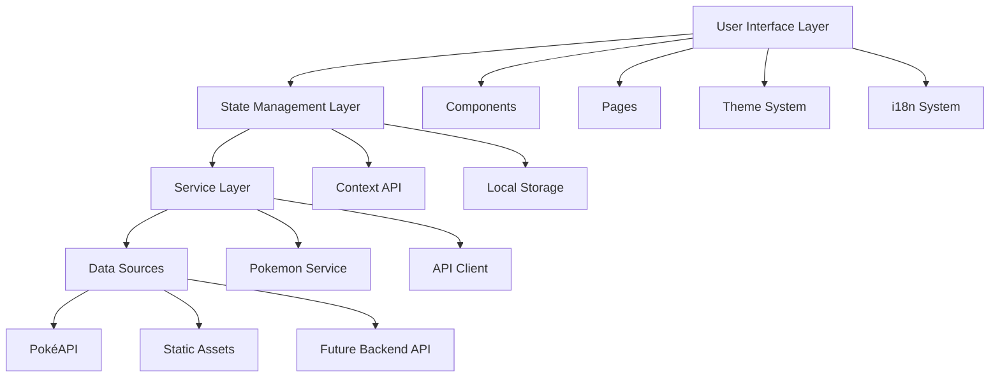

# Design Document

## Overview

The Modern Pokédex is a React-based single-page application built with TypeScript, featuring a responsive design system, internationalization support, and theme switching capabilities. The application will use the PokéAPI (https://pokeapi.co/) as the primary data source, with a service layer abstraction to enable future backend integration. The frontend will be containerized using Docker and optimized for performance with modern build tools.

## Architecture

### High-Level Architecture



### Technology Stack

- **Frontend Framework**: React 18 with TypeScript
- **Build Tool**: Vite for fast development and optimized builds
- **Styling**: Tailwind CSS with CSS custom properties for theming
- **State Management**: React Context API with useReducer for complex state
- **Internationalization**: react-i18next for EN/TH language support
- **Data Loading**: Native fetch API for future backend integration
- **Containerization**: Docker with multi-stage builds
- **Development**: ESLint, Prettier, and Husky for code quality

## Components and Interfaces

### Core Components

#### 1. Layout Components
- `AppLayout`: Main application wrapper with header, navigation, and content areas
- `Header`: Contains logo, theme toggle, and language selector
- `Navigation`: Search bar and filter controls
- `Footer`: Application information and links

#### 2. Pokemon Components
- `PokemonGrid`: Responsive grid layout for Pokemon cards
- `PokemonCard`: Individual Pokemon preview with image, name, types, and number
- `PokemonDetail`: Detailed view with comprehensive Pokemon information
- `PokemonStats`: Visual representation of Pokemon base stats
- `TypeBadge`: Styled badges for Pokemon types with appropriate colors

#### 3. UI Components
- `ThemeToggle`: Dark/light mode switcher with smooth transitions
- `LanguageSelector`: Dropdown for EN/TH language selection
- `SearchInput`: Debounced search input with clear functionality
- `FilterPanel`: Type-based filtering with multi-select capability
- `LoadingSpinner`: Consistent loading states across the application
- `ErrorBoundary`: Error handling and fallback UI

### Data Interfaces

```typescript
// Raw data structure from pokemon_kanto_dataset.json
interface PokemonRawData {
  dex_number: string;
  name: string;
  type_01: string;
  type_02: string;
  ability_01: string;
  ability_02: string;
  hidden_ability: string;
  egg_group_01: string;
  egg_group_02: string;
  is_legendary: string;
  bio: string;
  hp: string;
  attack: string;
  defense: string;
  sp_attack: string;
  sp_defense: string;
  speed: string;
}

// Helper interface for processing raw data into arrays
interface PokemonProcessedData {
  dexNumber: string;
  name: string;
  types: string[];
  abilities: string[];
  hiddenAbility: string;
  eggGroups: string[];
  isLegendary: boolean;
  bio: string;
  stats: {
    hp: number;
    attack: number;
    defense: number;
    spAttack: number;
    spDefense: number;
    speed: number;
  };
}

// Processed data structure for the application
interface Pokemon {
  id: number;
  dexNumber: string;
  name: string;
  localizedName?: string;
  imageUrl: string;
  types: PokemonType[];
  abilities: Ability[];
  hiddenAbility?: Ability;
  eggGroups: string[];
  isLegendary: boolean;
  bio: string;
  stats: PokemonStats;
}

interface PokemonType {
  name: string;
  color: string;
}

interface Ability {
  name: string;
  isHidden?: boolean;
}

interface PokemonStats {
  hp: number;
  attack: number;
  defense: number;
  spAttack: number;
  spDefense: number;
  speed: number;
  total: number;
}

interface AppState {
  pokemon: Pokemon[];
  selectedPokemon: Pokemon | null;
  loading: boolean;
  error: string | null;
  searchQuery: string;
  selectedTypes: PokemonType[];
  theme: 'light' | 'dark';
  language: 'en' | 'th';
}
```

## Data Models

### Pokemon Data Structure
The application will normalize Pokemon data from PokéAPI into a consistent format that supports localization and future backend integration. The data model includes:

- Basic information (id, name, image)
- Localized names for Thai language support
- Type information with associated colors for UI theming
- Physical characteristics (height, weight)
- Abilities with descriptions
- Base stats for visualization
- Flavor text descriptions

### State Management
The application state will be managed using React Context with the following structure:

- **Pokemon State**: List of Pokemon, selected Pokemon, loading states
- **UI State**: Search query, active filters, pagination
- **User Preferences**: Theme, language, stored in localStorage
- **Error State**: API errors, network issues, fallback handling

## Error Handling

### API Error Handling
- Network timeouts and connection errors
- Rate limiting from PokéAPI
- Invalid Pokemon IDs or missing data
- Graceful degradation when images fail to load

### User Experience Errors
- Empty search results with helpful messaging
- Loading states during API calls
- Retry mechanisms for failed requests
- Offline detection and appropriate messaging

### Error Boundaries
React Error Boundaries will catch JavaScript errors in component trees and display fallback UI instead of crashing the entire application.

## Testing Strategy

### Unit Testing
- Component testing with React Testing Library
- Service layer testing with mocked API responses
- Utility function testing for data transformation
- Hook testing for custom React hooks

### Integration Testing
- API integration tests with real PokéAPI endpoints
- Theme switching functionality
- Language switching and i18n integration
- Local storage persistence

### End-to-End Testing
- User journey testing with Playwright or Cypress
- Cross-browser compatibility testing
- Mobile responsiveness testing
- Performance testing for large Pokemon lists

### Performance Considerations
- Lazy loading for Pokemon images
- Virtual scrolling for large lists
- Debounced search input
- Memoization of expensive calculations
- Code splitting for route-based chunks

## Internationalization Design

### Language Support
- English (default): Complete Pokemon names and descriptions
- Thai: Localized Pokemon names where available, fallback to English
- UI text: All interface elements translated
- Number formatting: Localized height/weight units

### Implementation Approach
- JSON translation files for each language
- React-i18next for translation management
- Namespace organization for different sections
- Pluralization support for count-based text
- RTL support consideration for future languages

## Theme System Design

### Color Palette
- Light theme: Clean whites, soft grays, vibrant Pokemon type colors
- Dark theme: Deep backgrounds, high contrast text, adjusted type colors
- CSS custom properties for dynamic theme switching
- Accessibility compliance with WCAG contrast ratios

### Theme Implementation
- CSS-in-JS with styled-components or Tailwind CSS classes
- System preference detection
- Smooth transitions between themes
- Consistent theming across all components

## Docker Configuration

### Multi-stage Build
1. **Build Stage**: Node.js environment for building the React application
2. **Production Stage**: Nginx for serving static files

### Optimization Features
- Minimal base image (nginx:alpine)
- Gzipped static assets
- Proper caching headers
- Health check endpoint
- Configurable port binding
- Environment variable support for API endpoints

### Development vs Production
- Development: Hot reload with Vite dev server
- Production: Optimized static build served by Nginx
- Docker Compose for local development with volume mounting